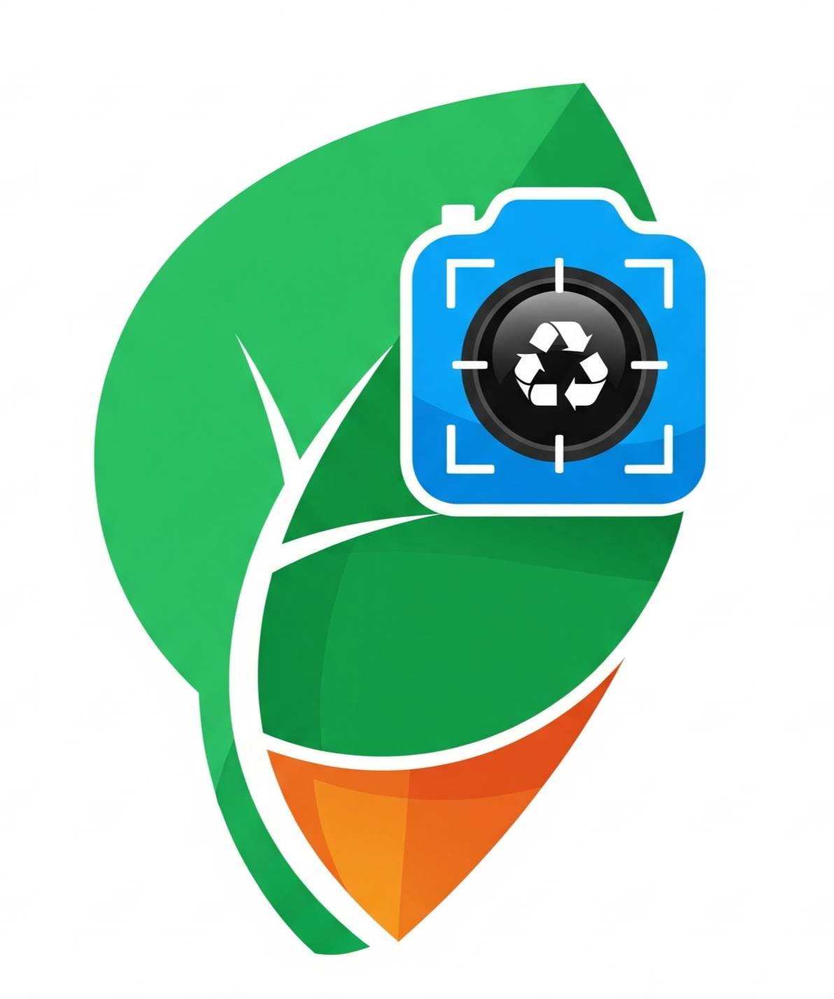

# SafaiSaathi

<a href="https://github.com/Yashg2604/SafaiSaathi">
<p align="center">
  
  </a>
<br/>
  <h3 align="center">SafaiSaathi</h3>


<div align="center" >

  </div>

  <p align="center">
     An app for waste classification and easy disposal
    <br/>
    <br/>
    <a href="https://www.youtube.com/watch?v=cXuOT-GMIVg">View Demo</a>
  </p>
</p>


## Table Of Contents

- [Table Of Contents](#table-of-contents)
- [About The Project](#about-the-project)
- [Built With](#built-with)
- [Getting Started](#getting-started)
  - [Prerequisites](#prerequisites)
  - [Installation](#installation)
- [Host your own](#host-your-own)

## About The Project


SafaiSaathi is an app designed to streamline waste management. Developed during the AI Manthan Hackathon, hosted by IIIT-D.  

This application is focused on making waste disposal easier through classification, user guidance, and innovative features such as a fine-tuned AI chatbot and voice-enabled interactions.


## Features

- **Gemini-powered chatbot**  
  - Multilingual support for user queries.  
  - Fine-tuned for accurate and context-aware responses to waste management questions.  

- **VoiceX voice interaction system**  
  - Uses **Sarvam API** for Automatic Speech Recognition (ASR) to convert voice input into text.  
  - Uses **Gemini** to generate natural voice responses from the ASR transcripts, enabling smooth conversational experiences.

- **Waste classification and disposal guidance**  
  - Helps users identify the correct category of waste.  


## Built With

* [NextJs](https://nextjs.org)
* [Bun](https://bun.sh/)
* [NextJS](https://nextjs.org)
* [TailwindCss](https://tailwindcss.com/)
* [MongoDb](https://www.mongodb.com/)
* [GoogleMaps](https://www.google.com/maps/)
* [Gemini](https://gemini.google.com/)
* [Gemini](https://gemini.google.com/) *(Chatbot engine & text-to-speech)*  
* [Sarvam API](https://sarvam.ai/) *(ASR – Automatic Speech Recognition)*  


## Getting Started


### Prerequisites

<a href="https://git-scm.com/downloads" >Git</a> is a distributed version control system used for software development. It allows multiple developers to work on the same codebase simultaneously, keeping track of changes and managing versions. It also enables users to revert changes and collaborate more effectively.

<a href="https://bun.sh/">Bun</a> is a JavaScript runtime, package manager, test runner bundler built from scratch using the Zig programming language. It was designed by Jarred Sumner as a drop-in replacement for Node.js. Bun uses JavaScriptCore as the JavaScript engine, unlike Node.js and Deno, which both use V8.

<a href="https://developers.google.com/maps/documentation/javascript/get-api-key">GoogleMaps Api key</a>

<a href="https://makersuite.google.com/app/apikey">Gemini Api Key</a> 

<a href="https://sarvam.ai/">Sarvam API Key</a>  


### Installation


<h3> This project utilises <a href="https://bun.sh">Bun</a>. Install it before running locally</h3>

```bash
git clone https://github.com/Yashg2604/SafaiSaathi
```
```bash
cd SafaiSaathi
```
```bash
cp .env.example .env
```
<h3>Fill the required fields inside the .env before starting the server </h3>

```bash
bun install
```
```bash
bun dev
```
This will start the development server  at http://localhost:3000/


